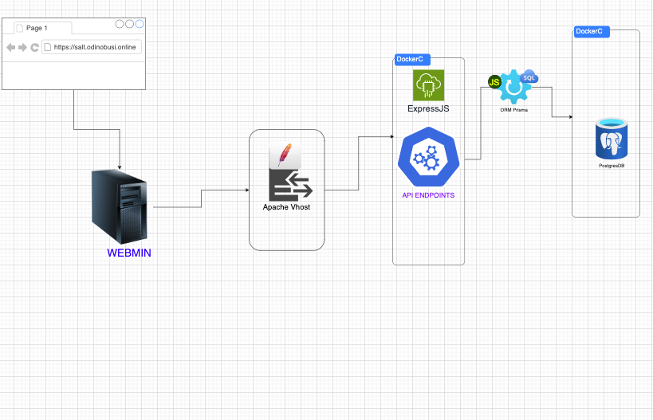

---

# TypeScript Project Setup Guide

This guide will walk you through the process of setting up a Node.js and TypeScript environment with necessary tools to build and run TypeScript files efficiently.

## Features

Here is the blueprint for the project:




## Prerequisites

Ensure that you have **Node.js** and **npm** (Node Package Manager) installed on your machine.

### 1. Verify Node.js and npm Installation

First, check if you have Node.js and npm installed by running the following commands in your terminal:

```bash
node --version
npm --version
```

If you see version numbers for both, you're good to proceed. If not, you'll need to download and install Node.js from [here](https://nodejs.org/).

### 2. Install TypeScript

To use TypeScript, you need to install it globally on your system. Run the following command:

```bash
npm install -g typescript
```

After installation, verify that TypeScript is installed correctly by checking its version:

```bash
tsc --version
```

### 3. Install ts-node

`ts-node` allows you to run TypeScript code directly in the Node.js environment, without having to compile it manually each time.

To install `ts-node`, run:

```bash
npm install -g ts-node
```

### 4. Install Nodemon

`nodemon` is a tool that automatically restarts your Node.js server whenever file changes are detected. This is very useful during development.

To install `nodemon`, run:

```bash
npm install -g nodemon
```

### 5. Initialize TypeScript Configuration

Once you have installed the required packages, you can initialize your TypeScript configuration with:

```bash
npx tsc --init
```

This will create a `tsconfig.json` file, which allows you to customize TypeScript compilation settings for your project.

---

### You're now set up to develop with TypeScript in Node.js!
